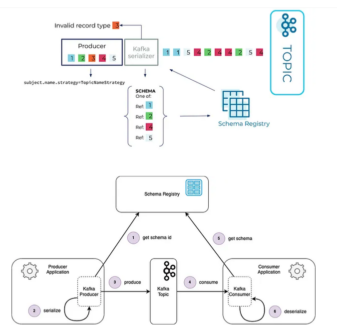
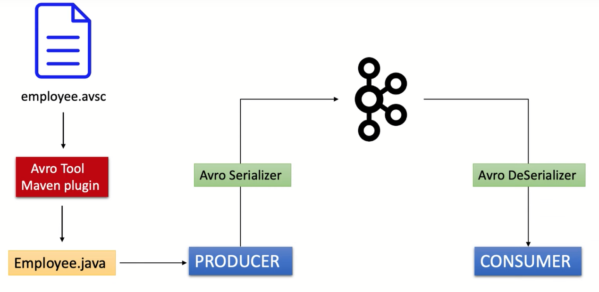
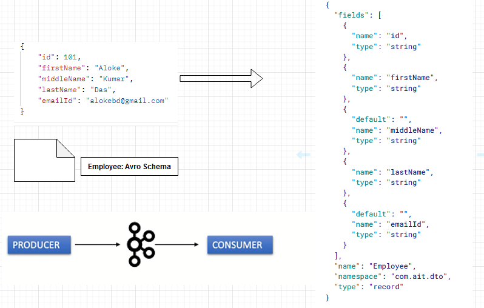
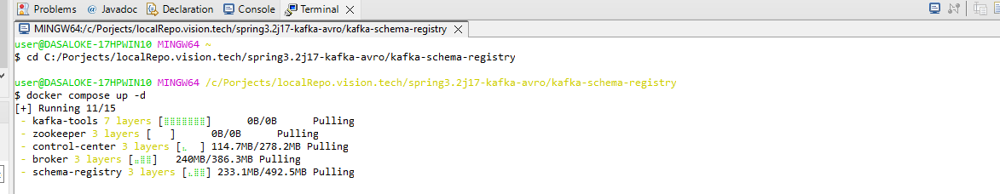
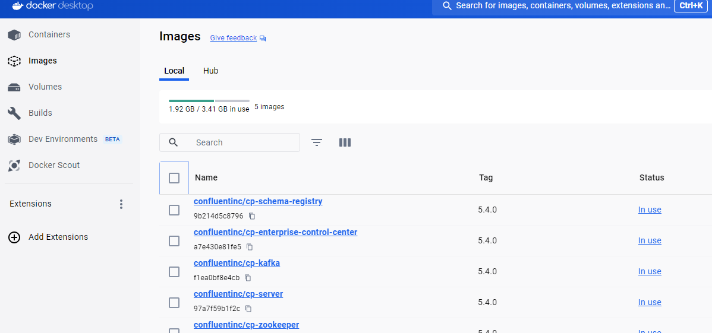
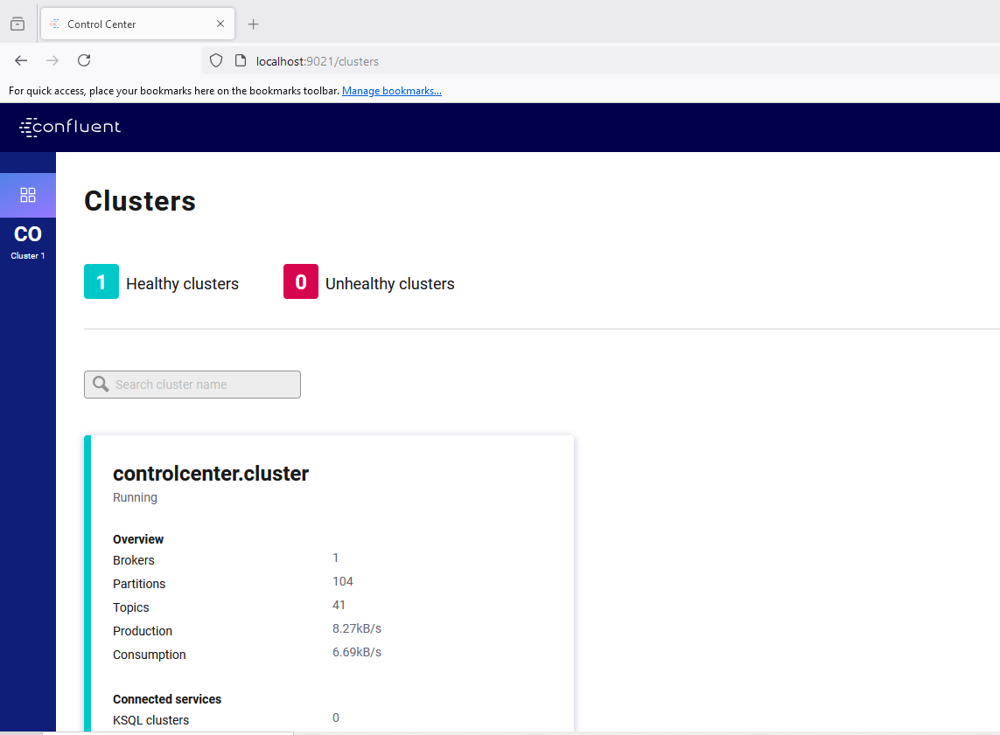
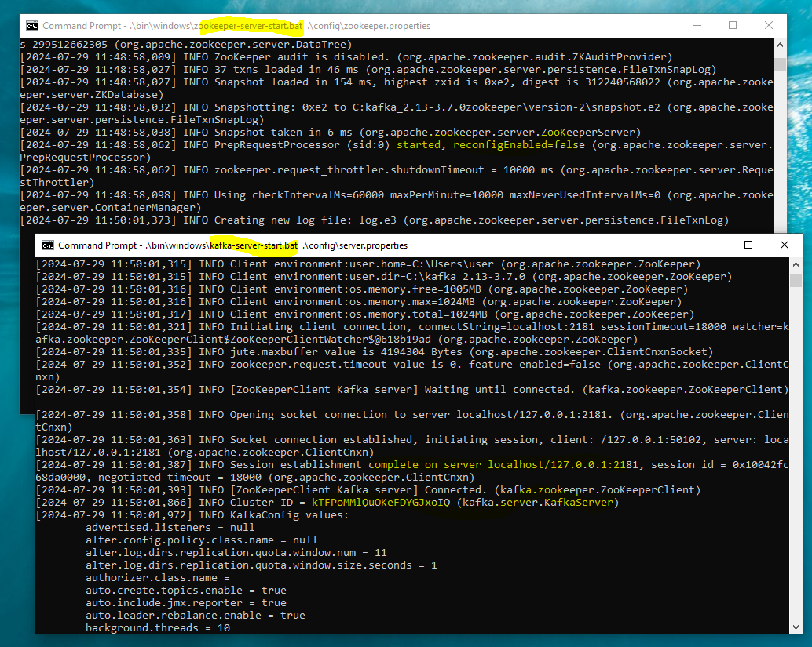
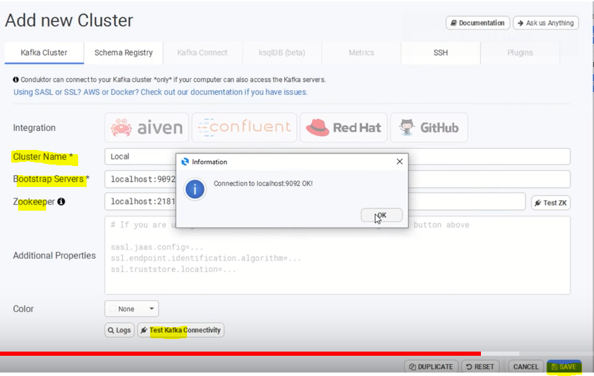

### Spring Boot Kafka Avro Producer & Consumer with Schema Registry
- Serialization and Deserialization (SerDes) in Kafka Streams wehre Avro is an open source data serialization, and processing frameworks. It helps define a binary format for our data, as well as map it to the programming language of our choice (i.e. JSON mapping).
- One of the critical features of Avro is the ability to define a schema for our data. 
- Schema Registry is a centralized service that manages and stores schemas for data exchanged in Apache Kafka. It provides a repository for storing and retrieving Avro, JSON Schema, or Protobuf schemas used for serializing and deserializing data in Kafka.


## About the Demo project
- The demo project has Employee Avro shcema that creates Employee object by Maven tool. 
- The Rest API tiggers the envent to produce employee. The Kafka Producer and Consumer verify the schema from the Schema Registory.
- The SerDes

- Emplyee Schema 


## Prerequisites
- Spring Boot (3.2)
- Maven 
- Java (17)
- Libraries:
  * starter-web 
  * kafka
  * lombok/logback
  * Avro
  * schema-registry
  * confluent

## (a). Docker Composer (check docker file)
* Run Docker (Docker Desktop version) 
* Go to terminal (to the application directory where the docker comple file, docker-compose.yml) as below:
- docker compose up -d
-
* Docker UI



- Go to control center (http://localhost:9021)



## (b). Alternatively Run Kafka Service locally as below:
- Kafka Servers Start (local: eg. C:\kafka_2.13-3.7.0)
*1) .\bin\windows\zookeeper-server-start.bat .\config\zookeeper.properties
*2) .\bin\windows\kafka-server-start.bat .\config\server.properties


- Local Check messages in Kafka 
- Accesssing Kafka through Conduktor (download- https://www.conduktor.io/get-started/desktop/ ,and create account free).
- Conduktor Configure the desktop connection (Cluster Name: local, Bootstrap Server: localhost:9092, Zookeeper: localhost:2123), test the connect and save


## Call (from Postman) Rest API (added postman collection)
- http://localhost:8181/events with following data

``` 
{
    "id": 101,
    "firstName": "Aloke",
    "middleName": "Kumar",
    "lastName": "Das",
    "emailId": "alokebd@gmail.com"
}
```


